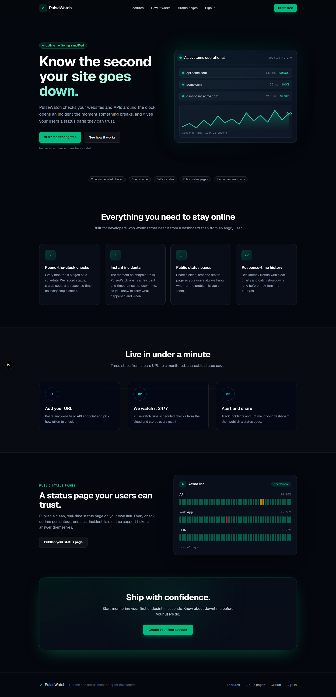
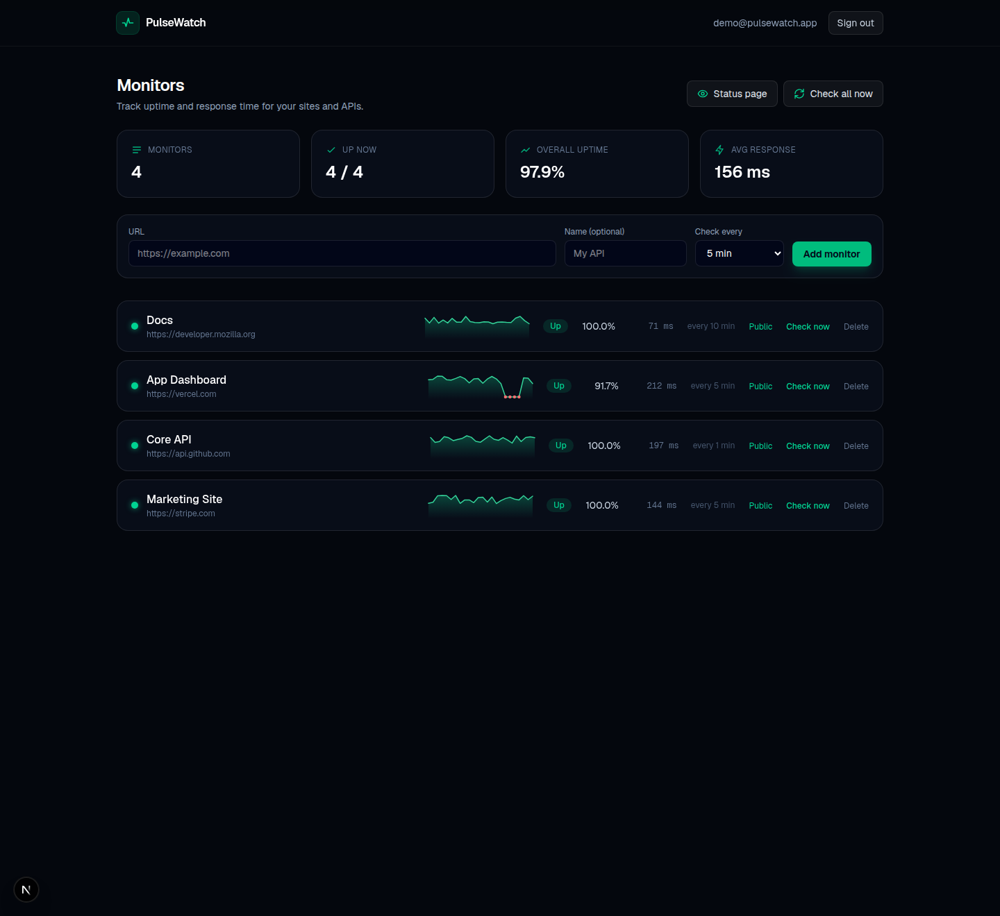
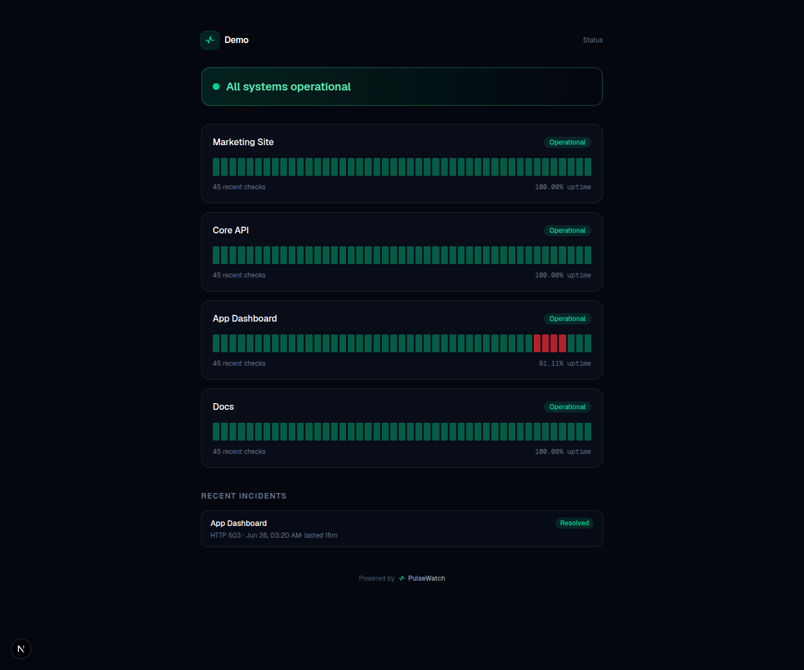

<div align="center">

# PulseWatch

### Open-source uptime and status monitoring for developers

Add a website or API, and PulseWatch checks it on a schedule, records status code and response time on every check, opens and resolves incidents automatically, and gives you a clean public status page to share.

[](https://github.com/gerboi68i/pulsewatch/actions/workflows/ci.yml)
[](LICENSE)
[](https://nextjs.org)
[](https://www.typescriptlang.org)
[](https://www.prisma.io)
[](CONTRIBUTING.md)

**[Live demo](https://pulsewatch-five.vercel.app)** &nbsp;&middot;&nbsp; **[Report a bug](https://github.com/gerboi68i/pulsewatch/issues)** &nbsp;&middot;&nbsp; **[Request a feature](https://github.com/gerboi68i/pulsewatch/issues)**



</div>

## Why PulseWatch

Most monitoring tools are either heavy, paid, or both. PulseWatch is a small, fast, self-hostable monitor you can stand up in minutes: a real Next.js app with auth, a Postgres-backed check engine, automatic incident tracking, and shareable status pages. Run it yourself for free, or use the hosted version.

## Features

- **Round-the-clock checks.** Every monitor is fetched on its own interval with a request timeout. Status, status code, and response time are recorded on every check.
- **Automatic incidents.** An incident opens the moment a monitor goes down and resolves itself on recovery, with the downtime timestamped.
- **Public status pages.** Flip any monitor to public and share a clean, real-time status page with uptime bars and an incident timeline, on your own link.
- **Response-time history.** Per-monitor sparklines and uptime percentages so you catch slowdowns before they become outages.
- **Run on demand or on a schedule.** Check now, check all, or drive checks from any external scheduler through a secret-guarded cron endpoint.
- **Multi-user and private by default.** Every user sees only their own monitors. Auth uses bcrypt-hashed passwords and signed, httpOnly session cookies.

## Screenshots

| Dashboard | Public status page |
| --- | --- |
|  |  |

## Tech stack

- **Next.js 16** (App Router, Server Actions) with **React 19** and **TypeScript**
- **Tailwind CSS v4** for styling, with a custom animation layer (scroll reveals, SVG chart draw-in, ambient gradients)
- **Prisma ORM** with **PostgreSQL** (works great on serverless Postgres such as Neon)
- **jose** for JWT sessions, **bcryptjs** for password hashing
- Deployed on **Vercel** with a scheduled cron job

## How it works

- The data model is **Users -> Monitors -> Checks** (one row per health check) and **Incidents**.
- `runCheckForMonitor` fetches the monitor URL with a 10 second timeout, marks it up on a 2xx or 3xx response, stores a `Check`, and runs the incident state machine: open on the first failure, resolve on the first success after a failure.
- `runDueChecks` selects monitors whose last check is older than their interval and checks them. It is exposed at `GET /api/cron`, guarded by a secret (Bearer token or `?key=`), so Vercel Cron or any external scheduler can drive it.
- Auth issues a signed JWT stored in an httpOnly, secure, sameSite cookie. Protected pages resolve the current user on the server and redirect to `/login` when there is no valid session.
- The status page at `/status/[id]` is public and server-rendered on demand, showing only the monitors a user has marked public.

## Quick start

```bash
git clone https://github.com/gerboi68i/pulsewatch.git
cd pulsewatch
npm install
cp .env.example .env        # fill in the values below
npx prisma migrate dev      # create the schema
npm run dev                 # http://localhost:3000
```

### Environment variables

| Variable | Purpose |
| --- | --- |
| `DATABASE_URL` | Pooled Postgres connection used at runtime |
| `DIRECT_URL` | Direct Postgres connection used for migrations |
| `SESSION_SECRET` | Secret used to sign session JWTs (`openssl rand -hex 32`) |
| `CRON_SECRET` | Guards the `/api/cron` endpoint (`openssl rand -hex 32`) |

### Optional: seed demo data

```bash
node --env-file=.env scripts/seed-demo.mjs
```

Creates a demo account with four public monitors and sample history. On the live demo you can sign in with **demo@pulsewatch.app** / **demodemo123**.

## Scheduling checks

Point any external scheduler (for example cron-job.org) at the cron endpoint to run checks every few minutes:

```
GET https://your-app.vercel.app/api/cron?key=YOUR_CRON_SECRET
```

The included `vercel.json` registers a daily fallback cron for Vercel Hobby.

## Deploy

[](https://vercel.com/new/clone?repository-url=https%3A%2F%2Fgithub.com%2Fgerboi68i%2Fpulsewatch&env=DATABASE_URL,DIRECT_URL,SESSION_SECRET,CRON_SECRET&envDescription=Postgres%20connection%20strings%20and%20session%2Fcron%20secrets)

PulseWatch runs anywhere Next.js does. The fastest path is Vercel plus a serverless Postgres database:

1. Fork this repo and import it into Vercel.
2. Add the four environment variables.
3. Deploy. Run `npx prisma migrate deploy` against your database once.

## Open core

PulseWatch is open source under the **AGPL-3.0** license: self-host it, modify it, and run it for free. A managed, hosted version with extra convenience features is offered separately. The AGPL keeps improvements open while protecting that hosted offering.

## Roadmap

- [x] Public, shareable status pages
- [ ] Per-monitor detail view with a full response-time chart and incident history
- [ ] Email and webhook alerts when incidents open and resolve
- [ ] Configurable assertions: expected status code, body contains, latency thresholds
- [ ] Multi-region checks
- [ ] Team workspaces

## Contributing

Contributions are welcome. See [CONTRIBUTING.md](CONTRIBUTING.md) for setup and guidelines, then open an issue or a pull request.

## License

[AGPL-3.0](LICENSE) (c) PulseWatch contributors.
